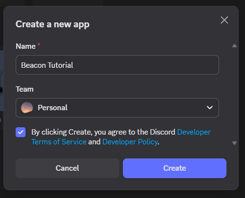
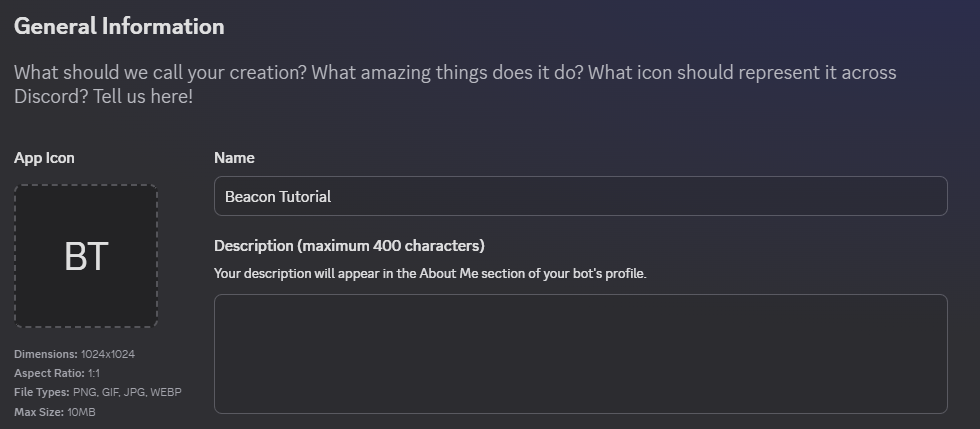
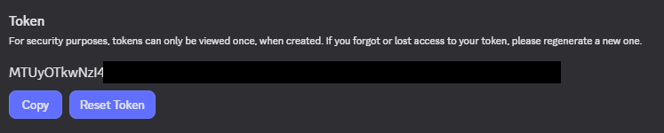
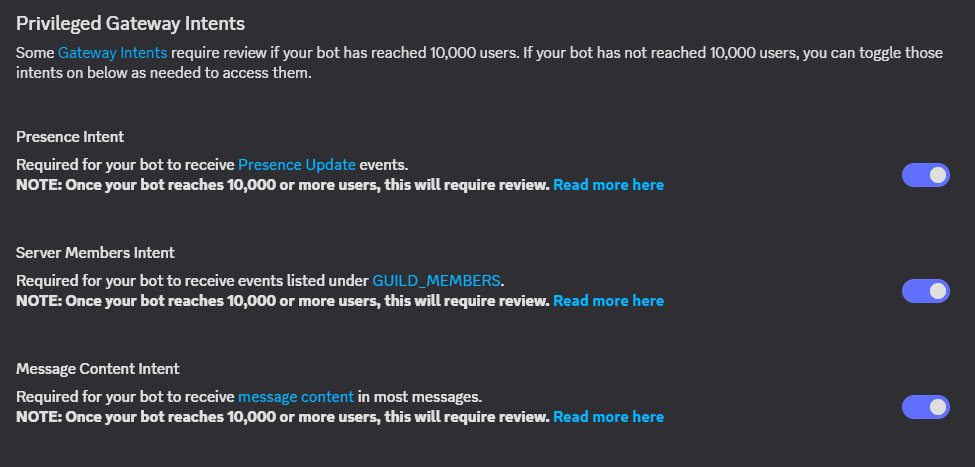

# Getting Started
So, you want to add Beacon to your server? Amazing! There's a few ways you can go about this:
## Offical Instance
Unfortunately, there is no official instance for Beacon yet due to the fact it is in a pre-release stage, but stay tuned, as we're hoping to do this soon!

## Self Hosting
### Creating a Discord app
Before you even begin to host the bot itself, you need to make an app on the Discord Developer Portal. This is what you actually invite to your Discord server.

1. Go to the [Discord Developer Portal](https://discord.com/developers/applications) and sign in.

2. Click 'New Application' in the top right and give it a name before agreeing to the Discord Developer ToS and clicking 'Create' in the window that appears.

    

3. You're now on your bot's application page. On the 'General Information' page, set an app icon, name (this is what appears as the bot's display name in Discord), description (the bot user's bio in Discord) and app icon.

    

4. Click 'Bot' in the sidebar, and click the purple 'Reset Token' button. It will get you to authenticate if you have multi-factor authentication enabled, so do this. Copy the token and save it somewhere safe, as you **cannot see this token again without generating a new one.**

    

5. Scroll down and turn on all the switches under 'Privileged Gateway Intents' and save.

    

6. Click 'OAuth2' in the sidebar and go to the 'OAuth2 URL Generator' section. From here:
    1. Tick the `bot` box.
    2. Scroll down and click 'Administrator' under 'General Permissions' (1).
    { .annotate }

        1. Administrator is sometimes a risky permission to grant, as a bot or user with this permission can modify the server however it wants. However, seeing as you are self-hosting the bot, as long as you keep your bot token secure, you should be ok.
    3. Change 'Integration Type' to 'Guild Install' in the drop down list.
    4. Copy the URL under 'Generated URL', visit it, and invite the bot to the server you need it in.

Congratulations, you have invited the bot to your server and can move on to hosting it!


### Hosting
There are multiple ways to self-host Beacon.
#### Docker
The GitHub repository has a handy Dockerfile which makes installation with Docker a breeze! 
##### Prerequesites
- Docker

##### Steps
1. Clone the GitHub repository into a location of your choice
    - With Git installed: In a terminal, run:
    ``` sh
    git clone https://github.com/privatedev11/Beacon.git
    ```
    - Without Git installed, go to the [GitHub repo online](https://github.com/privatedev11/Beacon.git), click the green 'Code' button at the top and click 'Download ZIP' in the dropdown that appears. Extract the downloaded ZIP to a folder of your choosing.
2. Fill in the `.env` file.

    There are some environment variables that need to be filled in for the bot to work properly. Create an empty file called `.env` and open it in a text editor. (1)
    { .annotate }

    1. In some operating systems, the dot before the file name may cause it to be invisible in a text editor.

    Copy this template into the file:
    ``` py
    DISCORD_TOKEN = ""
    DEV_GUILD =  ""
    ```
    In the quotes after `DISCORD_TOKEN` with your Discord Bot Token that you got in [step 4 of the previous section](gettingstarted.md#creating-a-discord-app).

    In the quotes after `DEV_GUILD` with the Server ID of the server you have invited the bot to. To get this:

    1. Enable Developer mode in Discord:
        - Go to settings
        - Scroll to the bottom of the sidebar and click 'Developer'
        - Enable Developer Mode in the menu that appears
    2. Right click your Discord server in the sidebar.
    3. Click 'Copy Server ID'.

3. Run `docker compose up` in a terminal. This will:
    - Auto install Python and all dependencies
    - Run the bot

4. From there it should work!

#### Manual Setup
##### Prerequesites
- Python

##### Steps
1. Clone the GitHub repository into a location of your choice
    - With Git installed: In a terminal, run:
    ``` sh
    git clone https://github.com/privatedev11/Beacon.git
    ```
    - Without Git installed, go to the [GitHub repo online](https://github.com/privatedev11/Beacon.git), click the green 'Code' button at the top and click 'Download ZIP' in the dropdown that appears. Extract the downloaded ZIP to a folder of your choosing.
2. Fill in the `.env` file.

    There are some environment variables that need to be filled in for the bot to work properly. Create an empty file called `.env` and open it in a text editor. (1)
    { .annotate }

    1. In some operating systems, the dot before the file name may cause it to be invisible in a text editor.

    Copy this template into the file:
    ``` py
    DISCORD_TOKEN = ""
    DEV_GUILD =  ""
    ```
    In the quotes after `DISCORD_TOKEN` with your Discord Bot Token that you got in [step 4 of the previous section](gettingstarted.md#creating-a-discord-app).

    In the quotes after `DEV_GUILD` with the Server ID of the server you have invited the bot to. To get this:

    1. Enable Developer mode in Discord:
        - Go to settings
        - Scroll to the bottom of the sidebar and click 'Developer'
        - Enable Developer Mode in the menu that appears
    2. Right click your Discord server in the sidebar.
    3. Click 'Copy Server ID'.

3. Create a Python virtual environment and activate it.

4. Install the required pip packages:
    ```
    pip install -r requirements.txt
    ```
5. You can now run `main.py` and it should work!
